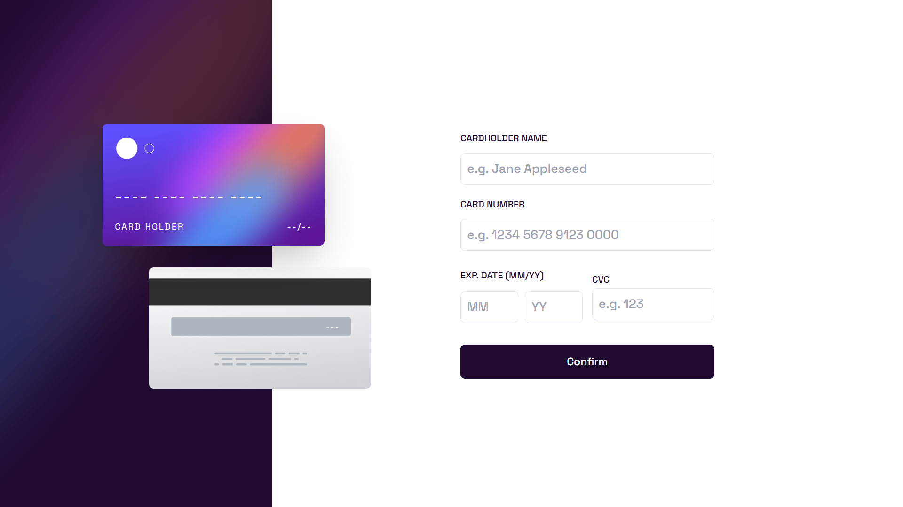
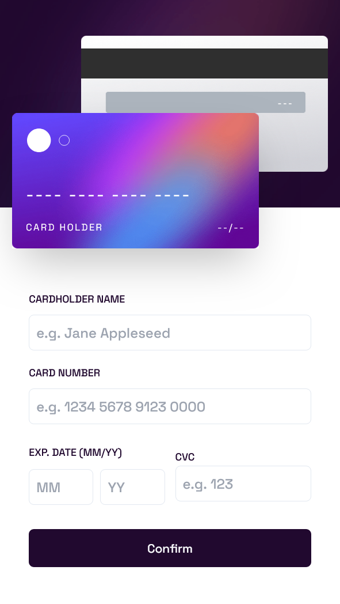

# Frontend Mentor - Interactive card details form solution

This is a solution to the [Interactive card details form challenge on Frontend Mentor](https://www.frontendmentor.io/challenges/interactive-card-details-form-XpS8cKZDWw).

## Table of contents

- [Overview](#overview)
  - [The challenge](#the-challenge)
  - [Screenshot](#screenshot)
  - [Links](#links)
- [My process](#my-process)
  - [Built with](#built-with)
  - [What I learned](#what-i-learned)
  - [Useful resources](#useful-resources)
- [Author](#author)

## Overview

### The challenge

Users should be able to:

- Fill in the form and see the card details update in real-time
- Receive error messages when the form is submitted if:
  - Any input field is empty
  - The card number, expiry date, or CVC fields are in the wrong format
- View the optimal layout depending on their device's screen size
- See hover, active, and focus states for interactive elements on the page

### Screenshot

#### Desktop

#### Mobile

### Links

- Solution URL: [Github repo](https://github.com/Sarah-okolo/Card-vault)
- Live Site URL: [https://card-vault.netlify.app/](https://card-vault.netlify.app/)

## My process

### Built with

- Semantic HTML5 markup
- Flexbox
- CSS Grid
- Mobile-first workflow
- [Tailwind CSS](https://tailwindcss.com/) - CSS framework
- [React](https://reactjs.org/) - JS library
- [Zustand](https://zustand.docs.pmnd.rs/getting-started/introduction) - State management library
- [Shadcn ui](https://ui.shadcn.com/) - UI components library

### What I learned

In this project, I was able to learn how to use the Tailwind CSS framework, as well as the Shadcn ui components library.

### Useful resources

- [Watching Tailwind tutorials is a waste of time](https://youtu.be/Ksn1tThNTjI?si=KpeU1hqj9Lws_zF_) - Thisvideo helped me save hours of tutorials on using tailwind css. I really liked this pattern and will use it going forward.
- [How to install Shadcn ui with React js](https://youtu.be/gXSC5eMw68o?si=rgmKdGII5h4TapnC) - This is an amazing video which helped me finally understand how to configure the Shadcn UI for my react js app. I'd recommend it to anyone still learning this issue.

## Author

- Frontend Mentor - [@sarah-okolo](https://www.frontendmentor.io/profile/Sarah-okolo)
- Twitter - [@sahraoke](https://x.com/SahraOke)